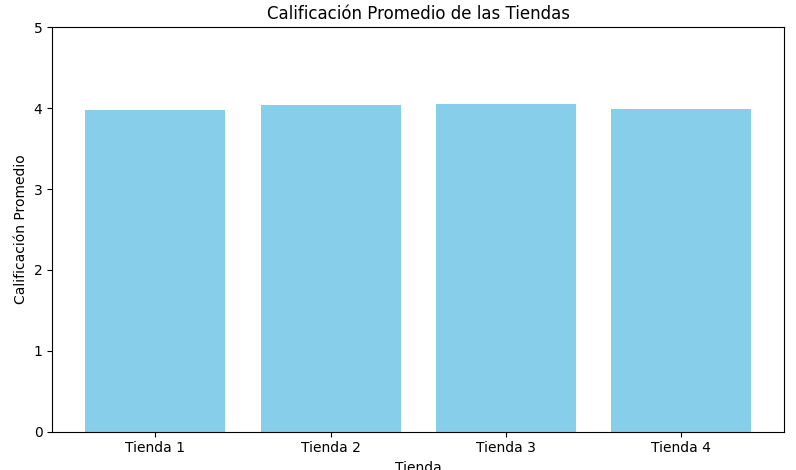
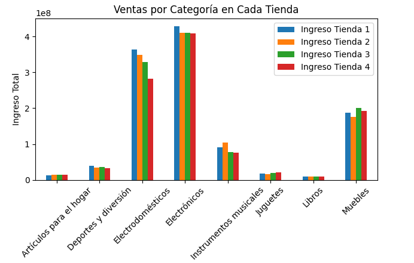
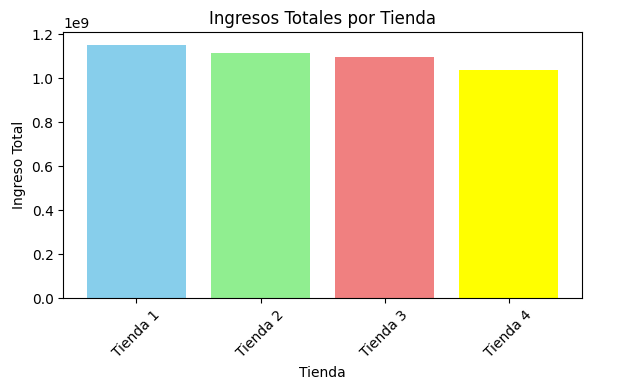

# **Informe de Análisis de Ventas por Tienda y Ubicación Geográfica**

## **Descripción del Proyecto**

Este proyecto tiene como objetivo realizar un análisis de las ventas de diferentes tiendas, utilizando datos relacionados con ingresos, categorías de productos y ubicación geográfica. A través de este análisis, buscamos identificar patrones de rendimiento y explorar si factores como la ubicación o la categoría de productos afectan las ventas de manera significativa.

El análisis incluye la exploración de datos de ventas y las coordenadas geográficas (latitud y longitud) de las tiendas, con el fin de generar visualizaciones que nos ayuden a entender mejor la distribución geográfica de las ventas.

## **Objetivos del Análisis**

El análisis tiene los siguientes objetivos clave:

1. **Examinar el rendimiento de las tiendas en relación con su ubicación**: Usaremos las coordenadas geográficas (latitud y longitud) para ver cómo las ubicaciones influyen en las ventas.
   
2. **Identificar patrones de ventas según las categorías de productos**: Queremos saber qué categorías de productos están teniendo el mayor impacto en los ingresos de las tiendas.

3. **Generar visualizaciones**: Crearemos gráficos de dispersión y mapas de calor (Heatmaps) para identificar áreas con mayor concentración de ventas y explorar posibles relaciones entre ubicación, ingresos y calificaciones de productos.

## **Datos Utilizados**

Los datos analizados provienen de varias tiendas e incluyen la siguiente información:

- **Categoría de productos**: Categorías como Electrodomésticos, Artículos para el hogar, Deportes, entre otros.
- **Ingresos**: Ingresos generados por cada tienda.
- **Calificación de productos**: Promedio de las calificaciones dadas por los clientes.
- **Costo de envío**: Costo asociado al envío de productos.
- **Ubicación geográfica**: Latitud y longitud de cada tienda.

Los datos de ejemplo se organizan de la siguiente manera:

| Tienda     | Categoría          | Ingreso Tienda 1 | Ingreso Tienda 2 | Ingreso Tienda 3 | ... |
|------------|--------------------|------------------|------------------|------------------|-----|
| Tienda A   | Electrodomésticos   | 3500000.0        | 4500000.0        | 1500000.0        | ... |
| Tienda B   | Artículos para el hogar | 1000000.0    | 2000000.0        | 3000000.0        | ... |

## **Metodología**

### **1. Análisis Exploratorio de Datos**
En primer lugar, realizamos un análisis exploratorio básico para entender las características de los datos. Este paso incluyó el análisis de las distribuciones de los ingresos, la comparación entre las diferentes categorías de productos y la exploración de los valores faltantes en los datos.

### **2. Visualización de Datos**
Utilizamos herramientas como **Matplotlib** y **Seaborn** para crear gráficos que ayudaran a identificar tendencias y patrones clave en los datos:

- **Gráficos de barras** para comparar los ingresos por tienda y por categoría.
- **Mapas de calor** para ver cómo se distribuyen las ventas geográficamente.

### **3. Análisis Geográfico**
Con los datos de latitud y longitud de las tiendas, analizamos la relación entre las ubicaciones y el rendimiento de ventas. Esto nos permitió generar mapas interactivos y visualizaciones de dispersión geográfica para identificar áreas con mayor concentración de ventas.

## **Resultados del Análisis**

### **Patrones de Ventas por Tienda y Categoría**
- **Electrodomésticos** y **Electrónica** mostraron ser las categorías con mayores ingresos. Este hallazgo sugiere que los consumidores están invirtiendo más en productos de tecnología y electrodomésticos.
- **Artículos para el hogar** y **Deportes y diversión** no presentaron un rendimiento tan destacado, lo que podría indicar una menor demanda o una mayor competencia en esas categorías.

### **Análisis Geográfico**
- El análisis geográfico reveló que las **tiendas ubicadas en zonas urbanas** o cerca de centros comerciales tienen un **mejor rendimiento** en comparación con las tiendas ubicadas en **áreas rurales**. Esto indica que la ubicación es un factor determinante en el rendimiento de las ventas.
- Los mapas de calor mostraron que las zonas con mayor densidad de población tienen más tiendas con altos ingresos.

## **Conclusiones**

A partir de los resultados obtenidos, podemos destacar los siguientes puntos:

1. **Rendimiento de las tiendas**: Algunas tiendas tienen un desempeño mucho mejor que otras, especialmente aquellas que se encuentran en zonas urbanas o de alto tráfico.
   
2. **Categorías de productos más rentables**: Las categorías de **Electrodomésticos** y **Electrónica** son las que están generando más ingresos, lo que sugiere que las tiendas deberían priorizar estos productos.

3. **Importancia de la ubicación geográfica**: Las tiendas ubicadas en áreas urbanas o comerciales tienen mejores resultados en términos de ventas. Las ubicaciones rurales tienden a tener un rendimiento inferior.

## **Recomendaciones**

- **Optimizar el inventario de productos electrónicos**: Dado el rendimiento superior de esta categoría, sería recomendable aumentar el inventario y las promociones en productos de tecnología.
  
- **Explorar nuevas ubicaciones urbanas**: Las tiendas deberían considerar expandirse a áreas urbanas o de mayor concentración de población para aprovechar el mayor potencial de ventas.

- **Ajustar estrategias de envío**: Las tiendas en áreas rurales deberían revisar sus costos y tiempos de envío, ya que esto podría estar afectando negativamente las ventas.

## **Imágenes**

Este informe proporciona una comprensión profunda de cómo las ubicaciones geográficas y las categorías de productos influyen en las ventas. Las conclusiones y recomendaciones obtenidas de este análisis pueden ser útiles para los responsables de la toma de decisiones comerciales.
